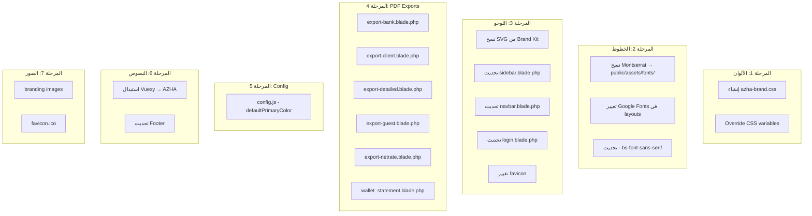

# 🎨 خطة تغيير الهوية البصرية - Azha Travel Hotels System

**التاريخ**: 2026-09-24 | **الحالة**: مسودة للمراجعة

---

## 📋 ملخص المشروع

تغيير الهوية البصرية بالكامل لنظام **Azha Travel Hotels** المبني على **Laravel + Vuexy Template** ليعكس هوية **أظهى للسفر** بدلاً من الهوية الافتراضية لقالب Vuexy.

> [!IMPORTANT]
> النظام حالياً يستخدم قالب **Vuexy** بالإعدادات الافتراضية بالكامل — اللوجو، الألوان، الخطوط، والنصوص كلها تابعة لـ Vuexy وليست مخصصة لـ Azha Travel.

---

## 🗺️ خريطة الملفات المتأثرة

### ملفات الـ Brand Kit المتاحة (المصدر)

| الملف | الوصف |
|-------|-------|
| [`Azha Travel Brand kit/1-Logo/SVG/`](file:///Users/mohamedayman/Herd/Azha%20Travel/hotels/Azha%20Travel%20Brand%20kit/1-Logo/SVG) | 6 نسخ SVG (light/dark × horizontal/vertical/icon) |
| [`Azha Travel Brand kit/1-Logo/PNG/`](file:///Users/mohamedayman/Herd/Azha%20Travel/hotels/Azha%20Travel%20Brand%20kit/1-Logo/PNG) | 6 نسخ PNG (10x) |
| [`Azha Travel Brand kit/2-Colors/`](file:///Users/mohamedayman/Herd/Azha%20Travel/hotels/Azha%20Travel%20Brand%20kit/2-Colors) | ملف الألوان (PDF + AI) |
| [`Azha Travel Brand kit/3-Font/English/Montserrat/`](file:///Users/mohamedayman/Herd/Azha%20Travel/hotels/Azha%20Travel%20Brand%20kit/3-Font/English/Montserrat) | خط Montserrat (إنجليزي) |
| [`Azha Travel Brand kit/3-Font/Arabic/Neue Frutiger World/`](file:///Users/mohamedayman/Herd/Azha%20Travel/hotels/Azha%20Travel%20Brand%20kit/3-Font/Arabic/Neue%20Frutiger%20World) | خط Neue Frutiger World (عربي) |
| [`Azha Travel Guidebook.pdf`](file:///Users/mohamedayman/Herd/Azha%20Travel/hotels/Azha%20Travel%20Brand%20kit/Azha%20Travel%20Guidebook.pdf) | دليل الهوية البصرية الكامل |

### ألوان البراند من SVG

| اللون | الكود | الاستخدام |
|-------|-------|-----------|
| **Navy Blue** (أزرق داكن) | `#12214c` | النصوص والعناوين الرئيسية |
| **Gold** (ذهبي) | `#af934e` | اللوجو والعناصر المميزة |

---

## 📌 المراحل التنفيذية

---

### 🔵 المرحلة 1: الألوان (Color System)

#### 1.1 تغيير متغيرات CSS الأساسية

**الملف**: [`public/assets/vendor/css/core.css`](file:///Users/mohamedayman/Herd/Azha%20Travel/hotels/public/assets/vendor/css/core.css)

> [!WARNING]
> هذا الملف ضخم (828KB, 28,872 سطر). يحتوي على كل متغيرات Bootstrap و Vuexy. **يجب تعديله بحذر شديد**.

**التغييرات المطلوبة**:

```diff
 :root, [data-bs-theme=light] {
-  --bs-primary: #7367f0;
+  --bs-primary: #12214c;
-  --bs-primary-rgb: 115, 103, 240;
+  --bs-primary-rgb: 18, 33, 76;
 }
```

**مصفوفة الألوان الجديدة**:

| المتغير | القيمة الحالية (Vuexy) | القيمة الجديدة (Azha) | الملاحظات |
|---------|----------------------|---------------------|----------|
| `--bs-primary` | `#7367f0` (بنفسجي) | `#12214c` (Navy Blue) | اللون الأساسي |
| `--bs-primary-rgb` | `115, 103, 240` | `18, 33, 76` | RGB للشفافية |
| `--bs-primary-bg-subtle` | `#e9e7fd` | `#e8eaf0` | خلفيات فاتحة |
| `--bs-primary-border-subtle` | `#c8c4f9` | `#b0b8cc` | حدود فاتحة |
| `--bs-primary-text-emphasis` | `#2e2960` | `#0a1230` | نصوص داكنة |

**ألوان إضافية مقترحة للبراند**:

| الغرض | اللون | الكود |
|-------|-------|-------|
| Primary (أساسي) | Navy Blue | `#12214c` |
| Accent (مميز) | Gold | `#af934e` |
| Accent Light | Light Gold | `#d4b876` |
| Accent Subtle BG | Gold 10% | `#faf6ee` |
| Secondary | Warm Gray | `#6b6b6b` |
| Success | ✅ يبقى كما هو | `#28c76f` |
| Warning | ⚠️ يبقى كما هو | `#ff9f43` |
| Danger | ❌ يبقى كما هو | `#ff4c51` |
| Info | يتغير للذهبي | `#af934e` |

#### 1.2 إنشاء ملف CSS Override مخصص

**إنشاء ملف جديد**: `public/assets/css/azha-brand.css`

بدلاً من تعديل core.css مباشرةً (لأنه يتأثر بتحديثات Vuexy)، نُنشئ ملف override:

```css
/* Azha Travel Brand Overrides */
:root,
[data-bs-theme=light] {
  --bs-primary: #12214c;
  --bs-primary-rgb: 18, 33, 76;
  --bs-primary-bg-subtle: #e8eaf0;
  --bs-primary-border-subtle: #b0b8cc;
  --bs-primary-text-emphasis: #0a1230;

  /* Azha Gold Accent */
  --azha-gold: #af934e;
  --azha-gold-rgb: 175, 147, 78;
  --azha-gold-light: #d4b876;
  --azha-gold-subtle: #faf6ee;

  /* Font override */
  --bs-font-sans-serif: "Montserrat", "Neue Frutiger World", -apple-system, sans-serif;
}

[data-bs-theme=dark] {
  --bs-primary: #af934e;
  --bs-primary-rgb: 175, 147, 78;
}
```

#### 1.3 تضمين الملف في كل الـ Layouts

**الملفات المتأثرة**:
- [`resources/views/admin/layouts/app.blade.php`](file:///Users/mohamedayman/Herd/Azha%20Travel/hotels/resources/views/admin/layouts/app.blade.php) (السطر 40)
- [`resources/views/admin/pages/login.blade.php`](file:///Users/mohamedayman/Herd/Azha%20Travel/hotels/resources/views/admin/pages/login.blade.php) (السطر 37)

```diff
 <link rel="stylesheet" href="{{ asset('assets/css/demo.css') }}" />
+<link rel="stylesheet" href="{{ asset('assets/css/azha-brand.css') }}" />
```

---

### 🔵 المرحلة 2: الخطوط (Typography)

#### 2.1 تجهيز ملفات الخطوط

**المطلوب**:
1. نسخ خط **Montserrat** من Brand Kit إلى `public/assets/fonts/montserrat/`
2. نسخ خط **Neue Frutiger World** إلى `public/assets/fonts/neue-frutiger/`
3. إضافة `@font-face` declarations في `azha-brand.css`

#### 2.2 تغيير Google Fonts

**الملفات المتأثرة** (تغيير Public Sans → Montserrat):

| الملف | السطر | التغيير |
|-------|-------|---------|
| [`app.blade.php`](file:///Users/mohamedayman/Herd/Azha%20Travel/hotels/resources/views/admin/layouts/app.blade.php) | 24-26 | Google Fonts link |
| [`login.blade.php`](file:///Users/mohamedayman/Herd/Azha%20Travel/hotels/resources/views/admin/pages/login.blade.php) | 21-23 | Google Fonts link |
| [`resources/css/app.css`](file:///Users/mohamedayman/Herd/Azha%20Travel/hotels/resources/css/app.css) | 9 | `--font-sans` variable |

```diff
-<link href="https://fonts.googleapis.com/css2?family=Public+Sans:ital,wght@0,300;0,400;0,500;0,600;0,700;1,300;1,400;1,500;1,600;1,700&ampdisplay=swap" rel="stylesheet" />
+<link href="https://fonts.googleapis.com/css2?family=Montserrat:ital,wght@0,300;0,400;0,500;0,600;0,700;1,300;1,400;1,500;1,600;1,700&display=swap" rel="stylesheet" />
```

#### 2.3 تغيير متغير الخط في core.css

```diff
-  --bs-font-sans-serif: "Public Sans", -apple-system, ...
+  --bs-font-sans-serif: "Montserrat", "Neue Frutiger World", -apple-system, ...
```

> [!NOTE]
> خط **Neue Frutiger World** هو خط مرخص (ليس مفتوح المصدر). إذا كان غير متوفر، سيتراجع النظام لـ Montserrat تلقائياً.
> بديل مقترح مفتوح المصدر للعربي: **Cairo** أو **Tajawal** من Google Fonts.

---

### 🔵 المرحلة 3: اللوجو والـ Branding

#### 3.1 استبدال لوجو Vuexy بلوجو Azha Travel

**الملفات المتأثرة (3 ملفات)**:

| الملف | السطر | المحتوى الحالي |
|-------|-------|----------------|
| [`vertical/sidebar.blade.php`](file:///Users/mohamedayman/Herd/Azha%20Travel/hotels/resources/views/admin/layouts/vertical/sidebar.blade.php) | 4-20 | SVG لوجو Vuexy + نص "Vuexy" |
| [`horizontal/navbar.blade.php`](file:///Users/mohamedayman/Herd/Azha%20Travel/hotels/resources/views/admin/layouts/horizontal/navbar.blade.php) | 5-22 | SVG لوجو Vuexy + نص "Vuexy" |
| [`login.blade.php`](file:///Users/mohamedayman/Herd/Azha%20Travel/hotels/resources/views/admin/pages/login.blade.php) | 74-109 | لوجو Vuexy (محذوف بالتعليق) + نص "Welcome to Vuexy!" |

**التغييرات**:

**للسايدبار والنافبار** — استبدال SVG الـ Vuexy بصورة لوجو Azha:

```html
<!-- Before -->
<span class="app-brand-logo demo">
    <span class="text-primary">
        <svg width="32" height="22" viewBox="0 0 32 22" ...>...</svg>
    </span>
</span>
<span class="app-brand-text demo menu-text fw-bold ms-3">Vuexy</span>

<!-- After -->
<span class="app-brand-logo demo">
    
</span>
<span class="app-brand-text demo menu-text fw-bold ms-3">AZHA Travel</span>
```

**لصفحة الـ Login** (سطر 108):

```diff
-<h4 class="mb-1 text-center">{{ __('Welcome to Vuexy! 👋') }}</h4>
+<h4 class="mb-1 text-center">{{ __('Welcome to AZHA Travel! 👋') }}</h4>
```

#### 3.2 تحضير ملفات اللوجو

**الإجراءات**:
1. نسخ SVG للوجو من Brand Kit إلى `public/assets/img/branding/`:
   - `azha-logo.svg` ← [`light background.svg`](file:///Users/mohamedayman/Herd/Azha%20Travel/hotels/Azha%20Travel%20Brand%20kit/1-Logo/SVG/light%20background.svg) (الأيقونة فقط)
   - `azha-logo-horizontal.svg` ← [`light background horizontal.svg`](file:///Users/mohamedayman/Herd/Azha%20Travel/hotels/Azha%20Travel%20Brand%20kit/1-Logo/SVG/light%20background%20horizontal.svg) (للسايدبار)
   - `azha-logo-dark.svg` ← [`dark background.svg`](file:///Users/mohamedayman/Herd/Azha%20Travel/hotels/Azha%20Travel%20Brand%20kit/1-Logo/SVG/dark%20background.svg) (للوضع الداكن)

2. استبدال الملفات الموجودة في `public/assets/img/branding/`:
   - [`brand-img-dark.png`](file:///Users/mohamedayman/Herd/Azha%20Travel/hotels/public/assets/img/branding/brand-img-dark.png) — حالياً لوجو Vuexy
   - [`brand-img-light.png`](file:///Users/mohamedayman/Herd/Azha%20Travel/hotels/public/assets/img/branding/brand-img-light.png) — حالياً لوجو Vuexy

#### 3.3 تغيير الـ Favicon

**الملف**: [`public/assets/img/favicon/favicon.ico`](file:///Users/mohamedayman/Herd/Azha%20Travel/hotels/public/assets/img/favicon/favicon.ico)

- إنشاء favicon جديد من لوجو Azha (الأيقونة الذهبية)
- أحجام مطلوبة: 16x16, 32x32, 48x48

---

### 🔵 المرحلة 4: صفحات تصدير PDF

#### 4.1 ملفات التصدير (6 ملفات)

هذه الملفات تستخدم inline CSS وألوان hardcoded:

| الملف | الألوان المستخدمة |
|-------|-------------------|
| [`export-bank.blade.php`](file:///Users/mohamedayman/Herd/Azha%20Travel/hotels/resources/views/admin/pages/bookings/pdf/export-bank.blade.php) | `#0d3c47` (header/footer), `#eef5fa` (rows), `#dae8f2` (alternating) |
| [`export-client.blade.php`](file:///Users/mohamedayman/Herd/Azha%20Travel/hotels/resources/views/admin/pages/bookings/pdf/export-client.blade.php) | `#fce4d6`, `#fbe5d6`, `#e2efda`, `#e2f0d9`, `#bdd7ee`, `#c00000`, `#385724`, `#a9d18e`, `#70ad47` |
| [`export-detailed.blade.php`](file:///Users/mohamedayman/Herd/Azha%20Travel/hotels/resources/views/admin/pages/bookings/pdf/export-detailed.blade.php) | مشابهة لـ client |
| [`export-guest.blade.php`](file:///Users/mohamedayman/Herd/Azha%20Travel/hotels/resources/views/admin/pages/bookings/pdf/export-guest.blade.php) | مشابهة لـ client |
| [`export-netrate.blade.php`](file:///Users/mohamedayman/Herd/Azha%20Travel/hotels/resources/views/admin/pages/bookings/pdf/export-netrate.blade.php) | مشابهة لـ client |
| [`wallet_statement.blade.php`](file:///Users/mohamedayman/Herd/Azha%20Travel/hotels/resources/views/admin/pdf/wallet_statement.blade.php) | `#0d3c47` (header), `#eef5fa` (rows), `#dae8f2` (alternating) |

#### 4.2 مصفوفة تحويل ألوان PDF

```
الحالي                      →  الجديد (Azha Brand)
──────────────────────────────────────────────────
#0d3c47 (header dark)       →  #12214c (Navy Blue)
#eef5fa (row light)         →  #f0f1f5 (Navy subtle)
#dae8f2 (row alternating)   →  #e0e3eb (Navy lighter)
#fce4d6 / #fbe5d6 (blush)  →  #faf6ee (Gold subtle)
#e2efda / #e2f0d9 (green)  →  #e8eaf0 (Navy very light)
#bdd7ee (light blue)        →  #d4b876 (Gold light)
#385724 (dark green)        →  #12214c (Navy Blue)
#a9d18e (green total)       →  #af934e (Gold)
#70ad47 (green header)      →  #af934e (Gold)
#c00000 (red)               →  يبقى كما هو (danger)
```

#### 4.3 تغيير لوجو PDF

**الملفات المتأثرة**:
- [`export-bank.blade.php`](file:///Users/mohamedayman/Herd/Azha%20Travel/hotels/resources/views/admin/pages/bookings/pdf/export-bank.blade.php) (سطر 72)
- [`wallet_statement.blade.php`](file:///Users/mohamedayman/Herd/Azha%20Travel/hotels/resources/views/admin/pdf/wallet_statement.blade.php) (سطر 80)

حالياً يستخدمون صورة `472228932_903900521859408_2733195805942687837_n.jpg` — يجب استبدالها بلوجو Azha الرسمي.

#### 4.4 تغيير خط PDF

الخط الحالي: `'DejaVu Sans'` و `'Aptos'` — يجب تغييره لـ `'Montserrat'` مع fallback مناسب.

---

### 🔵 المرحلة 5: إعدادات الـ Theme (Config)

#### 5.1 ملف config.js

**الملف**: [`public/assets/js/config.js`](file:///Users/mohamedayman/Herd/Azha%20Travel/hotels/public/assets/js/config.js)

```diff
 if (typeof TemplateCustomizer !== 'undefined') {
   window.templateCustomizer = new TemplateCustomizer({
     displayCustomizer: true,
+    defaultPrimaryColor: '#12214c',
     lang: localStorage.getItem('templateCustomizer-' + templateName + '--Lang') || 'en',
```

#### 5.2 إخفاء Template Customizer (اختياري)

إذا أردت إخفاء الـ customizer من المستخدمين:

```diff
-    displayCustomizer: true,
+    displayCustomizer: false,
```

---

### 🔵 المرحلة 6: تنظيف النصوص والمراجع

#### 6.1 استبدال كل ذكر لـ "Vuexy"

| الملف | السطر | النص الحالي | النص الجديد |
|-------|-------|-------------|-------------|
| [`vertical/sidebar.blade.php`](file:///Users/mohamedayman/Herd/Azha%20Travel/hotels/resources/views/admin/layouts/vertical/sidebar.blade.php) | 20 | `Vuexy` | `AZHA` |
| [`horizontal/navbar.blade.php`](file:///Users/mohamedayman/Herd/Azha%20Travel/hotels/resources/views/admin/layouts/horizontal/navbar.blade.php) | 22 | `Vuexy` | `AZHA` |
| [`login.blade.php`](file:///Users/mohamedayman/Herd/Azha%20Travel/hotels/resources/views/admin/pages/login.blade.php) | 108 | `Welcome to Vuexy!` | `Welcome to AZHA Travel!` |

#### 6.2 تحديث Footer

**الملف**: [`resources/views/admin/layouts/footer.blade.php`](file:///Users/mohamedayman/Herd/Azha%20Travel/hotels/resources/views/admin/layouts/footer.blade.php) — إضافة حقوق ملكية Azha Travel.

---

### 🔵 المرحلة 7: الصور والأصول (Assets)

#### 7.1 ملفات الـ Branding الحالية

**المجلد**: [`public/assets/img/branding/`](file:///Users/mohamedayman/Herd/Azha%20Travel/hotels/public/assets/img/branding)

| الملف الحالي | الحجم | المطلوب |
|-------------|-------|---------|
| `brand-img-dark.png` | 5.5KB | استبدال بلوجو Azha (dark) |
| `brand-img-light.png` | 6KB | استبدال بلوجو Azha (light) |
| `brand-img-small.png` | 3KB | استبدال بأيقونة Azha (small) |
| `logo.png` | 1.1KB | استبدال بأيقونة Azha |

#### 7.2 ملف اللوجو في Public Root

**الملف**: [`public/cropped-Azha-LOGO-600x157.webp`](file:///Users/mohamedayman/Herd/Azha%20Travel/hotels/public/cropped-Azha-LOGO-600x157.webp) — موجود بالفعل لكن لا يُستخدم في الـ admin panel.

---

## 📊 ملخص التغييرات حسب الملفات



## 📁 قائمة الملفات الكاملة للتعديل

### ملفات يتم إنشاؤها (جديدة)

| # | الملف | الوصف |
|---|-------|-------|
| 1 | `public/assets/css/azha-brand.css` | CSS Override للبراند |
| 2 | `public/assets/img/branding/azha-logo.svg` | لوجو SVG (light) |
| 3 | `public/assets/img/branding/azha-logo-horizontal.svg` | لوجو SVG أفقي |
| 4 | `public/assets/img/branding/azha-logo-dark.svg` | لوجو SVG (dark) |
| 5 | `public/assets/fonts/montserrat/*` | ملفات خط Montserrat |

### ملفات يتم تعديلها (موجودة)

| # | الملف | نوع التعديل |
|---|-------|-------------|
| 1 | [`resources/views/admin/layouts/app.blade.php`](file:///Users/mohamedayman/Herd/Azha%20Travel/hotels/resources/views/admin/layouts/app.blade.php) | إضافة CSS + تغيير خط |
| 2 | [`resources/views/admin/pages/login.blade.php`](file:///Users/mohamedayman/Herd/Azha%20Travel/hotels/resources/views/admin/pages/login.blade.php) | لوجو + خط + نصوص |
| 3 | [`resources/views/admin/layouts/vertical/sidebar.blade.php`](file:///Users/mohamedayman/Herd/Azha%20Travel/hotels/resources/views/admin/layouts/vertical/sidebar.blade.php) | لوجو + نص |
| 4 | [`resources/views/admin/layouts/horizontal/navbar.blade.php`](file:///Users/mohamedayman/Herd/Azha%20Travel/hotels/resources/views/admin/layouts/horizontal/navbar.blade.php) | لوجو + نص |
| 5 | [`resources/views/admin/layouts/footer.blade.php`](file:///Users/mohamedayman/Herd/Azha%20Travel/hotels/resources/views/admin/layouts/footer.blade.php) | حقوق ملكية |
| 6 | [`resources/views/admin/pages/bookings/pdf/export-bank.blade.php`](file:///Users/mohamedayman/Herd/Azha%20Travel/hotels/resources/views/admin/pages/bookings/pdf/export-bank.blade.php) | ألوان + لوجو |
| 7 | [`resources/views/admin/pages/bookings/pdf/export-client.blade.php`](file:///Users/mohamedayman/Herd/Azha%20Travel/hotels/resources/views/admin/pages/bookings/pdf/export-client.blade.php) | ألوان |
| 8 | [`resources/views/admin/pages/bookings/pdf/export-detailed.blade.php`](file:///Users/mohamedayman/Herd/Azha%20Travel/hotels/resources/views/admin/pages/bookings/pdf/export-detailed.blade.php) | ألوان |
| 9 | [`resources/views/admin/pages/bookings/pdf/export-guest.blade.php`](file:///Users/mohamedayman/Herd/Azha%20Travel/hotels/resources/views/admin/pages/bookings/pdf/export-guest.blade.php) | ألوان |
| 10 | [`resources/views/admin/pages/bookings/pdf/export-netrate.blade.php`](file:///Users/mohamedayman/Herd/Azha%20Travel/hotels/resources/views/admin/pages/bookings/pdf/export-netrate.blade.php) | ألوان |
| 11 | [`resources/views/admin/pdf/wallet_statement.blade.php`](file:///Users/mohamedayman/Herd/Azha%20Travel/hotels/resources/views/admin/pdf/wallet_statement.blade.php) | ألوان + لوجو |
| 12 | [`public/assets/js/config.js`](file:///Users/mohamedayman/Herd/Azha%20Travel/hotels/public/assets/js/config.js) | defaultPrimaryColor |
| 13 | [`resources/css/app.css`](file:///Users/mohamedayman/Herd/Azha%20Travel/hotels/resources/css/app.css) | `--font-sans` |
| 14 | [`public/assets/img/branding/*`](file:///Users/mohamedayman/Herd/Azha%20Travel/hotels/public/assets/img/branding) | استبدال صور |
| 15 | [`public/assets/img/favicon/favicon.ico`](file:///Users/mohamedayman/Herd/Azha%20Travel/hotels/public/assets/img/favicon/favicon.ico) | أيقونة جديدة |

---

## ⚡ أولويات التنفيذ

| الأولوية | المرحلة | الجهد المقدر | التأثير |
|----------|---------|-------------|---------|
| 🔴 P1 | المرحلة 3: اللوجو + النصوص | 30 دقيقة | عالي — أول شيء يراه المستخدم |
| 🔴 P1 | المرحلة 1: الألوان | 45 دقيقة | عالي — يغير شكل كل العناصر |
| 🟡 P2 | المرحلة 2: الخطوط | 30 دقيقة | متوسط — يحسن القراءة |
| 🟡 P2 | المرحلة 5: Config | 5 دقائق | متوسط — يمنع الـ customizer من إعادة الألوان |
| 🟢 P3 | المرحلة 4: PDF | 60 دقيقة | متوسط — يؤثر على التصديرات |
| 🟢 P3 | المرحلة 6: تنظيف | 15 دقيقة | منخفض — تفاصيل |
| 🟢 P3 | المرحلة 7: الصور | 20 دقيقة | منخفض — تفاصيل |

**الإجمالي المقدر**: ~3-4 ساعات عمل

---

## ⚠️ نقاط مهمة

> [!CAUTION]
> 1. **ملف core.css ضخم** — لا تعدله مباشرةً. استخدم ملف override بدلاً من ذلك.
> 2. **خط Neue Frutiger World مرخص** — تأكد من وجود الترخيص قبل استخدامه على السيرفر.
> 3. **PDF templates تستخدم inline CSS** — كل تغيير لازم يكون في الملف نفسه، مش في ملف CSS خارجي.
> 4. **الـ TemplateCustomizer** يحفظ الألوان في localStorage — المستخدمين الحاليين محتاجين يمسحوا الـ cache.

> [!TIP]
> - ابدأ بتجهيز ملف `azha-brand.css` وتضمينه — هذا وحده سيغير شكل النظام بالكامل.
> - استخدم `defaultPrimaryColor` في config.js عشان يفرض اللون حتى لو المستخدم غيّره قبل كدة.
> - اختبر التصديرات بعد كل تغيير لأن mPDF يتعامل مع CSS بشكل مختلف عن المتصفح.

---

## ✅ هل تريد البدء بالتنفيذ؟

اضغط **Proceed** وسأبدأ بتنفيذ المراحل بالترتيب، أو أخبرني لو عاوز تعديل أي حاجة في الخطة.
